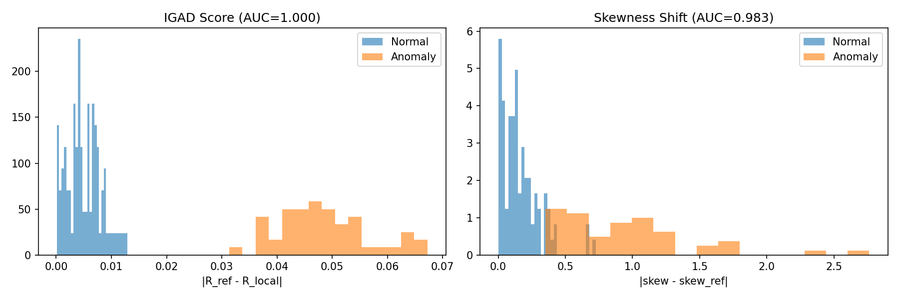
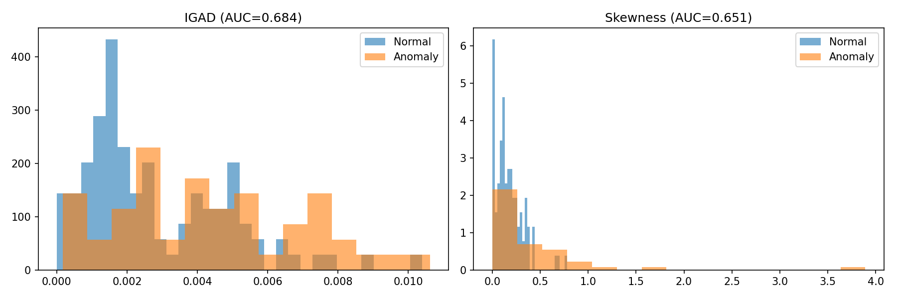

# IGAD: Information-Geometric Anomaly Detection

**Information-Geometric Anomaly Detection via Fisher-Rao Scalar Curvature**

## Overview

IGAD is a Python library for detecting anomalies using information geometry, specifically leveraging the Fisher-Rao scalar curvature of statistical manifolds. This approach provides a principled, geometric framework for identifying outliers and anomalies in data.

## Key Features

- **Fisher-Rao Curvature**: Computes the scalar curvature of statistical manifolds
- **Anomaly Detection**: Detects points with unusual geometric properties
- **Multiple Distribution Families**: Support for Gaussian, Poisson, Gamma, and other exponential families
- **Third Cumulant Analysis**: Advanced tensor computations for distribution geometry

## Demonstrations

### Basic Demo


### Hard Cases Demo



## Why IGAD?

Most traditional anomaly detection algorithms (like Isolation Forest, Mahalanobis distance, or LOF) operate on a fundamental assumption: anomalies exist far from the center of the data. 

**But what if an anomaly is hiding in plain sight?** Consider a system degradation where the new data points share the exact same mean and variance as normal operations, but have a fundamentally different distributional shape (e.g., a shift in skewness). Distance-based detectors are completely blind to these shape-shifting anomalies.

**IGAD fills this gap.** By measuring the scalar curvature of the Fisher-Rao manifold, IGAD is inherently sensitive to the squared norm of the third cumulant tensor — the multivariate generalization of skewness. The IGAD score elegantly compares the local statistical geometry of a test point's neighborhood against the global reference geometry, allowing you to detect structural anomalies that leave location and scale unchanged.

## Installation

```bash
pip install -r requirements.txt
python setup.py install
```

### Requirements
- Python >= 3.9
- numpy >= 1.24
- scipy >= 1.10
- scikit-learn >= 1.2

## Usage: Full Anomaly Scoring Workflow

```python
The true power of IGAD lies in comparing global reference curvature to local neighborhood curvature. Here is how to compute the IGAD anomaly score for test points:

```python
import numpy as np
from sklearn.neighbors import NearestNeighbors
from igad.families import GammaFamily
from igad.curvature import scalar_curvature

# 1. Setup Data
X_train = np.random.gamma(shape=9.0, scale=3.0, size=(500, 1)) # Reference data
X_test = np.array([[3.0], [8.0], [27.0]]) # Points to evaluate

# 2. Compute Global Reference Geometry
# Fit MLE to the entire reference dataset
alpha_ref, beta_ref = GammaFamily.fit_mle(X_train)
theta_ref = GammaFamily.to_natural(alpha_ref, beta_ref)

# R_ref is the scalar curvature of the normal operating state
R_ref = scalar_curvature(GammaFamily.log_partition, theta_ref)

# 3. Local Geometry & Anomaly Scoring (k-NN)
k = 20
nn = NearestNeighbors(n_neighbors=k).fit(X_train)
distances, indices = nn.kneighbors(X_test)

igad_scores = []

for i, neighbors_idx in enumerate(indices):
    local_data = X_train[neighbors_idx]
    
    # Fit local MLE for the test point's neighborhood
    alpha_local, beta_local = GammaFamily.fit_mle(local_data)
    theta_local = GammaFamily.to_natural(alpha_local, beta_local)
    
    # Compute local scalar curvature
    R_local = scalar_curvature(GammaFamily.log_partition, theta_local)
    
    # The IGAD Score: Difference between global and local curvature
    score = R_ref - R_local
    igad_scores.append(score)

print(f"Global Reference Curvature: {R_ref:.4f}")
for pt, score in zip(X_test.flatten(), igad_scores):
    print(f"Point {pt:5.1f} | IGAD Score: {score:.4f} (Higher = More Anomalous)")
```

## Testing

Run the test suite:
```bash
pytest tests/ -v
```

## Author

Omry Damari

## License

See [LICENSE](LICENSE) file for details.
